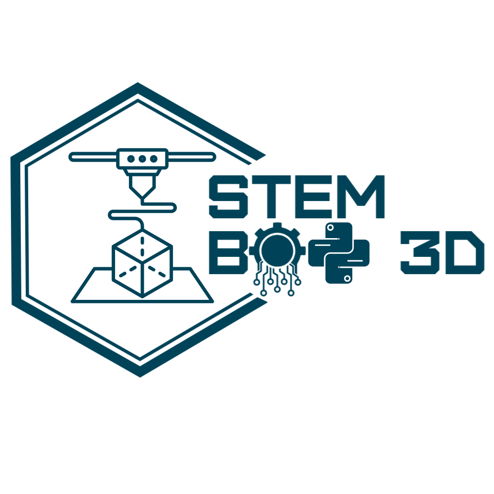

# STEM BOT 3D 🚀

<p align="center">
  
</p>

<p align="center">
  <strong>
    Querido Algoritmo, conéctame con otros locos obsesionados con Startup & Tech.
  </strong>
</p>

---

## 🌌 Sobre el proyecto

STEM BOT 3D es una landing page minimalista creada para compartir mi viaje en el mundo de:

- Tecnología
- Startups
- Ingeniería
- Robótica
- Programación
- Diseño 3D
- Inteligencia Artificial

La idea es construir una comunidad de personas apasionadas por crear, aprender y desarrollar tecnología.

---

## ⚡ Tech Stack

Este proyecto fue construido utilizando:

- Next.js
- React
- Tailwind CSS
- Node.js

---

## 📱 Redes Sociales

### TikTok
👉 https://www.tiktok.com/@stem_bot_3d

### Instagram
👉 https://www.instagram.com/stembot3d/

---

## 🧠 Filosofía

> Aprender construyendo.

Este proyecto representa mi inicio explorando:

- desarrollo web moderno
- frontend engineering
- servidores Linux
- deploy
- GitHub
- startups tech
- arquitectura web

---

## 🚀 Deploy

El proyecto está desplegado con:

- Vercel
- Next.js

---

## 📂 Instalación local

```bash
git clone https://github.com/TUUSUARIO/stembot3d.git

cd stembot3d

npm install

npm run dev
```

---

## 🌍 Objetivo

Construir proyectos tecnológicos reales, aprender públicamente y conectar con personas obsesionadas con crear cosas increíbles.

---

<p align="center">
  Made with ☕ + ⚡ + obsesión tecnológica.
</p>